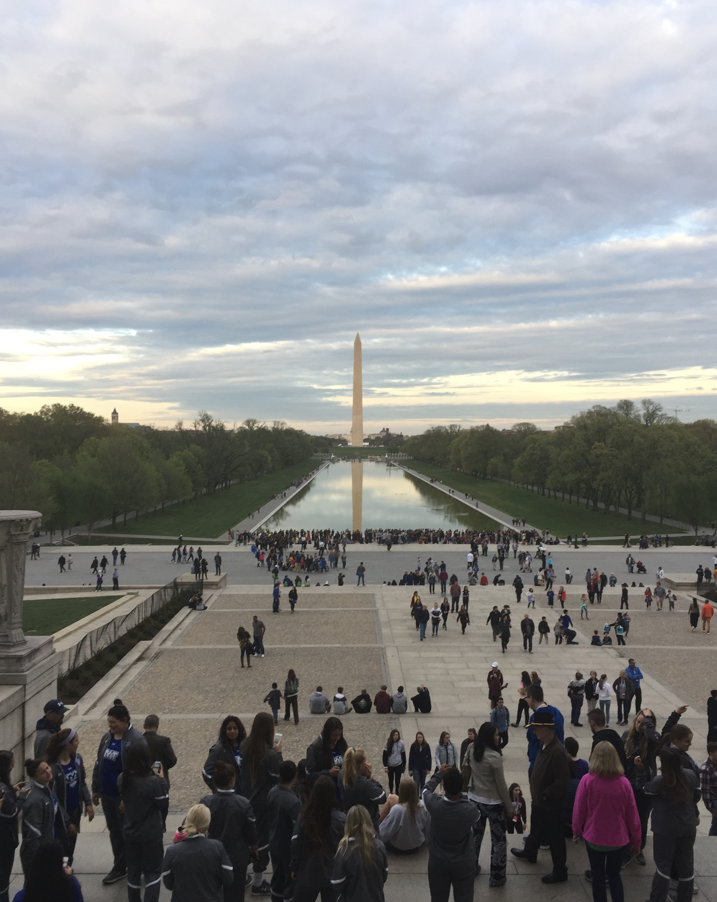
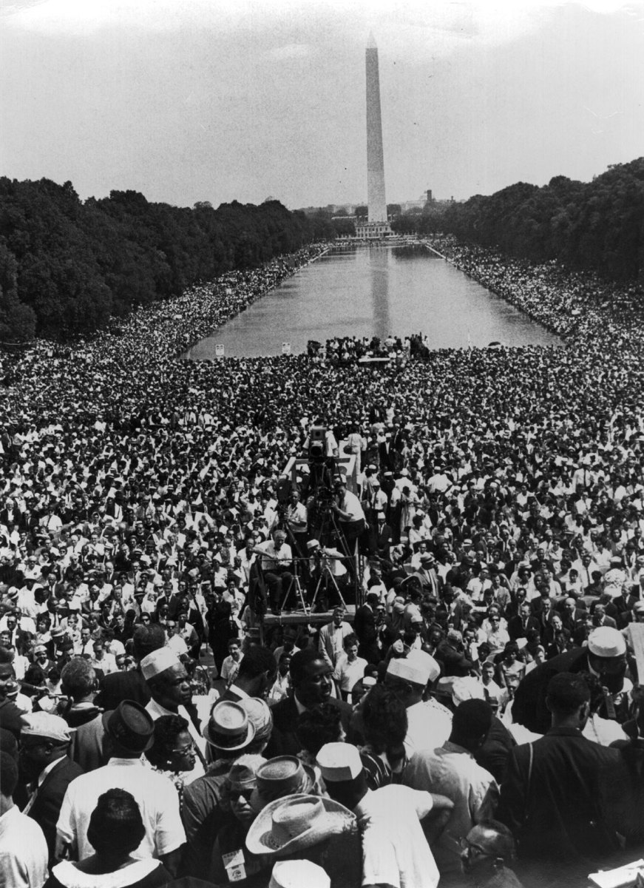

<h1 align=center>Reflections</h1>

>“This program invites you to engage in an anti-racist curriculum that challenges you to look at the climate crisis and intersecting issues from an interdisciplinary and critical perspective.” —Synthesis 1 Syllabus

    
<h2>Operating in Ignorance</h2>
Only on rare, usually disastrous, occasions does news about the climate crisis reach the attention of the average American, so anyone wanting to learn more is effectively left to seek out information on their own. On the New York Times website, a “Climate” tab is available only when first in the “Science” section. On the Fox News website, under “More…” is the scientific news section “Planet Earth” interestingly sandwiched between “Archeology” and “Dinosaurs,” and even the majority of those headlines have little to do with climate change or its effects. On the BBC News website, “Climate” is placed third after “War in Ukraine” and “Coronavirus” tabs on its homepage. This process is similar for all major news websites online today. Clearly, then, climate change is not prioritized by the media and begs the question: “What information is lost as a result?” The Synthesis program endeavors to answer this by providing sources that are all related to the climate crisis, but at times presented unexpectedly. It took me time to realize the purpose behind presenting the climate crisis in this manner: there are correct and incorrect solutions to the climate crisis, and any simplistic solutions will be incorrect.
 
 
Prior to this course, I learned about the climate crisis through (1) my science classes with topics like the greenhouse effect and clean energy and (2) widely-reported events like natural disasters or climate protests, originating from sources both supporting and criticizing such events. As a result, I was not knowledgeable about the actual conversations surrounding it and why some treat it like a social issue. To my knowledge, it was solely a scientific phenomenon and thus needed scientific solutions, not social ones. This initial mental framework limited me in the beginning of the course, since the first piece I read was Dungy's “Environmental Writing” which inspected environmentalism through a racial justice perspective. It made little sense to me, and I feared I would have to fabricate some sort of connection between climate change and racism for assignments throughout the quarter. 
 
 
However, Bastian’s article on “Fatal Confusion” was a dense, philosophical work concerning the concept of time itself, misunderstood somewhere in the translation from ecological timescale into societal timeframes when talking about the climate crisis. Although objectively a more complex and difficult read, I found its philosophical nature interesting and engaging; there were concepts and ideas I had heard about, but never argued or organized in this way. She did not necessarily “fix” climate change or even offer a concrete solution in her article like I had expected either, and her purpose was different, feeling similar to a report of an exploration charting something completely new. To dismantle and redefine an idea as abstract as time without resolution, yet somehow simultaneously connect it to climate change, was surreal to me. The loss of remaining time to act felt like the best argument for climate change reform to me up to this point, and yet it is hard to argue that time is running out when the concept of time and the devices used to measure it have been treated as unsound. My preconceived ideas felt shattered, but by the end of a thorough analysis of the piece, I felt more knowledgeable than before. For this reason, I found Bastian’s article brilliant and believe it to be the beginning of my understanding of the deeper intricacies of the course. 
 
 

<i>Salvador Dali, via DaliPaintings.com. 1954. “Soft Watch at the Moment of First Explosion”</i>

Then the works that followed started to fall in line and contribute to a new, and much broader, mental framework of understanding the climate crisis. Each piece no longer carried my initial burden to completely fix the issue, but instead just offered more information about it. It turned out to be a simple change in mindset, but it made all the difference when approaching a new piece to analyze. In fact, some authors devoted themselves to climate justice, which argues for the inseparability of climate change and racial inequality. As a result, any proposed solution to the climate crisis must also take into account those who are most affected and ensure their well-being. Such a solution is called a “just transition,” and rather than acting as a restriction on the conversation about the climate crisis, it actually becomes an invitation to both be knowledgeable about more topics as well as propose better solutions than ones known currently. This concept also allows pieces like the film Snowpiercer and a children’s book about renewable energy to have meaningful connections. In general, no author in this course stands alone, but instead exists in an interconnected web that participates in a dialogue whose collective concern is what we can call the climate crisis.

So why categorize the climate crisis as a social issue and not solely scientific? The first reason is adopting this idea of interconnectedness and collective concern immediately transforms it into a social phenomenon. The second is the notion of a just transition previously mentioned, since any scientific resolutions will have related social consequences. Third, the communication of data about the climate operates more as a political science instead of a data science, i.e. people will align with their political ideologies first before believing a scientific consensus. A final, more pragmatic reason is that activism is working: a 2021 Yale study described “The Greta Effect,” noting familiarity with the activist Greta Thunberg predicted intentions to engage in climate activism, and it is considered a key factor in the resurgence of a concern for climate change beginning in 2019. Given this, it would be inadequate to consider the climate crisis only as a scientific phenomenon, and in fact could even be harmful if the tenets of climate justice were to be ignored when working to fix it.

<h2>A Brief History of Change in America</h2>
Reflecting on what all these ideas from the course meant to me, I think back on all of the largest, most effective social movements (i.e. activism) in history. Examining only American history, moments of change become key chapters in the American story. I once went to Washington, D.C. for a school trip, and one of the most memorable events there was standing on the steps of the Lincoln Memorial and looking at the Washington Monument across the vast reflecting pool—I vividly remember *experiencing* history on those steps. Three key, historical changes conceptually present there overran my mind, attaching to what I had learned in my history class:
 
 

<i>Photo taken by me. April 27, 2018. “National Mall”</i>

The story starts with change—people revolutionize against their ruler and fight for independence. General George Washington then becomes the first president after a miraculous victory, where his contemporaries only hope their new country built on a menagerie of Western philosophies can survive on its own under his leadership. Yet, he leads masterfully and the people call for Washington to be king; he declines it and thus cements the ultimate precedent for all who follow. His monument, at which I only stare, silently stands as a reminder of the nation that founding fathers like him built. What they built is not perfect and reliant on the known, immoral practice of slavery, but they intentionally construct the Constitution so those in the future could change it when the country directly faces that immorality. Such change takes courage, however, and the presidents that follow deflect this inevitable timebomb for eighty years. The North experiences industrial revolutions that disrupt economic reliance on slavery noticeably, yet the South refuses to change as the country grows in size but only further divides over the issue. 

The timebomb then explodes.

1857: The Supreme Court rules Black freedmen and slaves are not citizens, but instead objects; 1860: Abraham Lincoln, known critic of slavery, gets elected; 1861: Southern states fearing slave emancipation secede and establish the Confederacy; 1861–1865: Civil War ravages the nation. Facing his country now at war, Lincoln devotes himself to restoring the union—a union that would return changed and start dedicating itself to the proposition that all men are created equal, so in 1863 he drafts a national proclamation of emancipation. In November, Lincoln delivers dedicatory words to a crowd on a field five months after a deadly battle there. I find these words, immortalized as the Gettysburg Address, on the left wall in the memorial behind me which serve as a reminder of great leaders who inspired change when it mattered most. Lincoln eventually achieves his goal of a restored union, but now presides over a country with deep scars that lead to his eventual assassination. His pursuit of what was right would ultimately cost his life, and is precisely why we celebrate him.

The South undergoes reconstruction in every aspect but morally; Black Americans still face discrimination and governments pass laws to ensure its legality even into the middle of the twentieth century. America is not fixed, it seems, but the movement to improve does not stop. Exactly a century after the Emancipation Proclamation and Gettysburg Address, Martin Luther King Jr. leads the March on Washington, and on the very steps where I stand, he delivers “I Have A Dream” to a crowd of 250,000, and millions more over broadcast, to demand civil rights and an end to racism. His courage, like Lincoln, became the motivation of others’ hatred to assassinate King on April 4th; President Johnson would sign the Civil Rights Act of 1968 a week later to formally end the civil rights era. 
 
 

<i>via Hulton Archive. August 28, 1963. “March on Washington”</i>

This story encapsulates a lot of information quite densely, but that truly was what I felt when standing on the memorial steps because it is a place to really understand American history. MLK’s push for rights only gains more poignancy knowing he is fighting inside the union which Lincoln preserved and Washington started, himself recognizing this progression by where he chose to deliver his most iconic speech. Though as seen from recent events and authors from this course, the push for racial justice is by no means finished in America, and the role of climate change in what it all will look like cannot be understated in my opinion. In the same way that justice has been fervently chased in this country by those later named icons of their generation, so too will the generation that addresses this crisis, with justice in mind, echo a movement with an ideological epicenter on those steps in Washington first shaken centuries ago. Ultimately, it inspires me to ask: What’s next for those monument steps? 

<h2>Closing Thoughts</h2>
I once heard the purpose of education is to teach how to think, not what to think. I don’t know if that’s true, but I would like it to be and think others do too, including those behind the Synthesis Program. However, I do know that moment on the Lincoln Memorial steps taught me how to think. I also know life is all about learning, and realistically the most important lessons are learned outside of a class and in teaching moments, many of which occur outside of our control but are nevertheless worthwhile. Climate change, then, must be seen as an opportunity to learn. It has many aspects—mathematical, biological, anthropological, cultural, political, etc.—each scrutinized individually, but it should not be reduced as such; it itself can be a teaching moment with available knowledge greater than the sum of its parts. The entire course proves this: each author can be studied individually, just as pieces to a puzzle can be examined individually, though the greater purpose of both is pointing to the existence of a much larger picture. 
 
 
And admittedly climate change can be somewhat frightening, because the notion of a threat to human existence with the remaining time to act counting down, all while witnessing inaction in response, is not supposed to be comforting. Life unfortunately is unsettling at times, but thankfully it is a lot of other things as well, including hopeful. What Bastian says is uncertainty does not mean hopelessness, and the complexities of reality with no clear path forward is exactly what we need to coordinate ourselves with to make a path. I would add on to say people ultimately get heard—they have historically and I don’t see why it would be irrelevant only for the climate crisis. But that means people still have to care about it, and what that looks like is inherently individual and possibly requires (re)learning how to think about the ideas we say we know best. Data shows that just using data doesn’t convince people to care, and even deniers of climate change and proponents of climate justice share the sentiment that action should not be adopted en masse just because it sounds good. Instead, a complete and familiar knowledge of the issue is necessary to ensure interests do not conflict and resulting action is just. Education in this sense becomes the job of a lifetime, and if it hasn’t started for you yet, I hope it does now.
